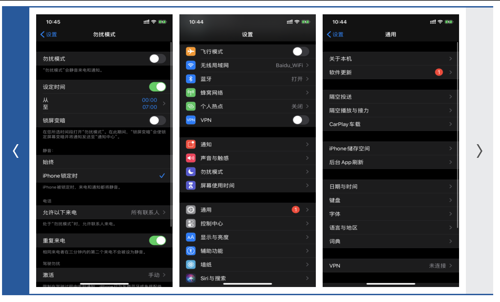
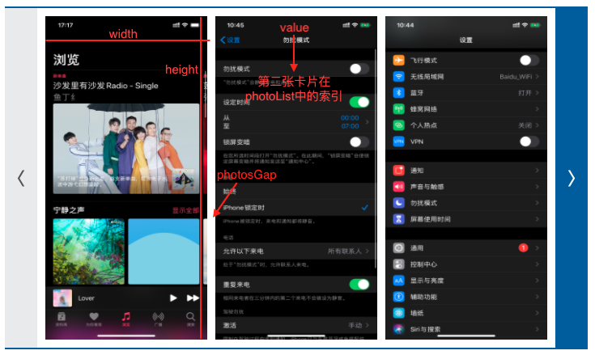
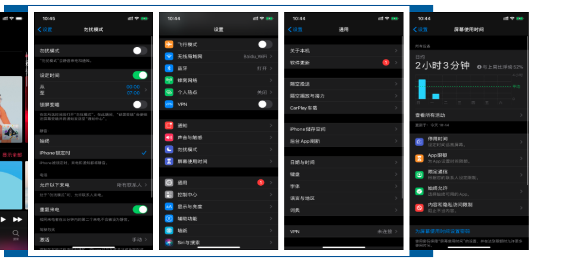
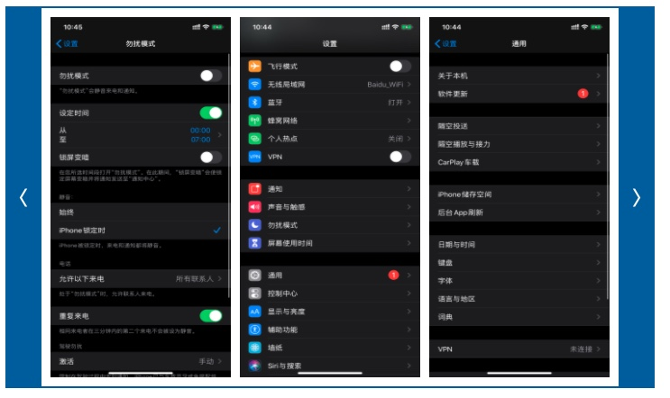

## image-preview

### 展示

卡片滑动组件



### 使用

1. 导入 阿里云 ifont 链接，在 public/index.html 导入

   ```html
   <head>
     ……
   	<link rel="stylesheet" href="//at.alicdn.com/t/font_1996391_z6d55i4tg3.css">
   </head>
   ```

   

2. 将 src/components 目录下的 ImagePreview 文件复制到项目的 src/components 目录或其他位置

3. 在需要引入该组件的 vue 文件中导入

   ~~~vue
   <template>
     <div id="app">
       <image-preview
         :showNumber="3"
         :width="200"
         :height="400"
         :photosGap="10"
         :value="1"
         :photoList="photoUrlsArr"
         @on-change="changeImage">
       </image-preview>
     </div>
   </template>
   
   <script>
   import ImagePreview from './components/ImagePreview.vue';
   
   export default {
     data() {
       return {
         // 图片数组
         photoUrlsArr: [
           "/imgs/0.png",
           "/imgs/2.png",
           "/imgs/3.png",
           "/imgs/4.png",
           "/imgs/5.png"
         ]
       }
     },
     components: {
       ImagePreview
     },
     methods: {
       // 图片滑动时父组件中的操作，index 为 ImagePreview Props 中的 value
       changeImage(index) {
         console.log("index: ", index)
       }
     }
   }
   </script>
   ~~~

### props



| 名称       | 作用                                    | 是否必要 | 默认值 | 范围                       |
| ---------- | --------------------------------------- | -------- | ------ | -------------------------- |
| showNumber | 展示卡片数量                            |          | 3      |                            |
| width      | 每张卡片的宽度                          |          | 200    | >0                         |
| height     | 每张卡片的高度                          |          | 400    | >0                         |
| photosGap  | 两张卡片之间的间隙                      |          | 10     | >0                         |
| value      | 初始化卡片索引(即加载时出现的img是哪张) |          | 1      | 0<=val<=photoList.length-1 |
| photoList  | 卡片地址数组                            |          | []     |                            |

### methods

父组件

```vue
<image-preview ...props @on-change="changeImage"></image-preview>

<script>
import ImagePreview from './components/ImagePreview.vue';

export default {
  ……
  methods: {
    // 图片滑动时父组件中的操作，index 为 ImagePreview Props 中的 value
    changeImage(index) {
      console.log("index: ", index)
    }
  }
}
</script>
```

子组件

on-change 是在 image-preview 中定义的事件，每次点击按钮滑动的时候会通知父组件

~~~js
changeShowUrls(isLeft) {
  // 滑动操作
  ……
  // 通知父组件，并带上 index 数据
  this.$emit('on-change', this.index)
}
~~~

### 优点

普通滑动组件，会将传输进来的 photoList 全部缓存在页面中，然后隐藏显示图片之外的所有图片，当数据量小的时候影响不大，但是当数据量达到一定量级时，进入页面加载组件需要加载那么多的 图片url，必然导致页面加载缓慢


imagePreview 组件每次只会缓存 showNumber+2 张图片，当showNumber=3时如下，将隐藏关闭：



其实展示了5张图片，将超出的隐藏：



每次点击左右按钮滑动的时候，只要操作 showUrls，保持每次都只展示 showNumber+2 张图片，加快页面加载速度